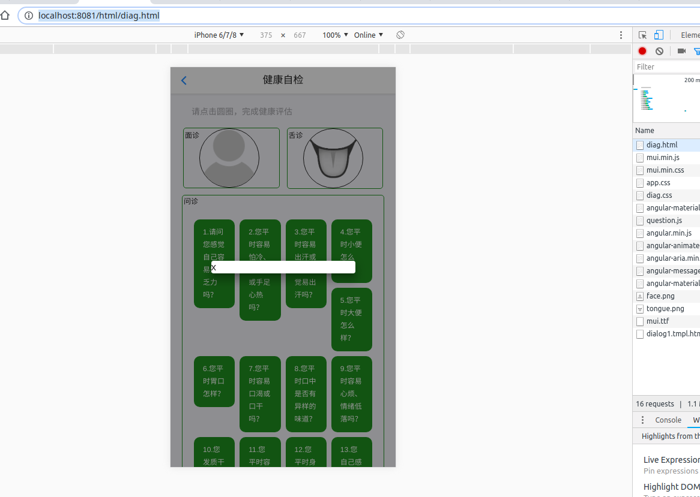

# html5代码
```

    ├── css
    ├── data
    │   └── question.js  所有问题
    ├── fonts
    ├── html
    │   ├── diag.html          诊断页面
    │   ├── dialog1.tmpl.html  dialog模板
    │   ├── new-webview.html
    │   ├── tab-webview-subpage-chat.html
    │   └── tab-webview-subpage-contact.html
    ├── images
    ├── index.html
    ├── js

```

# 代码调试

dialog需要本地开一个server
可通过在5plus目录下执行
`python3 -m http.server 8001`
然后通过 http://localhost:8081/html/diag.html 打开



# Todo：
实现了把question的内容和选项传入dialog，下一步根据选择题类型，显示单选或多选  
目前echarts显示有问题（显示不出来……）
